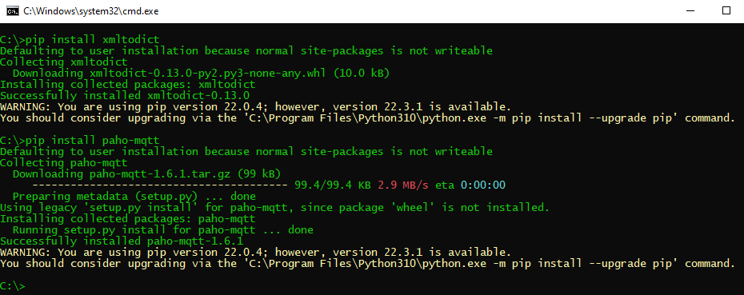
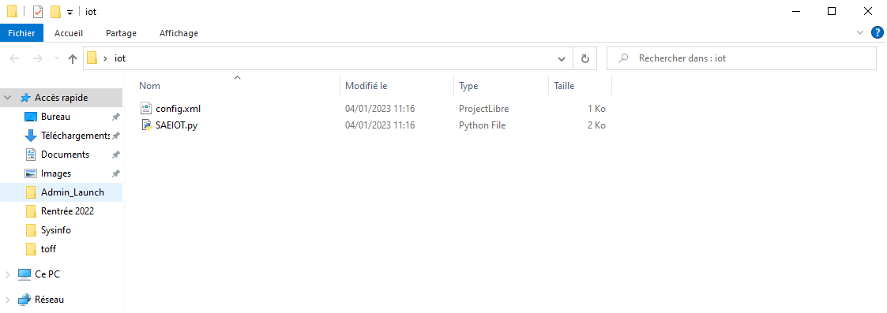
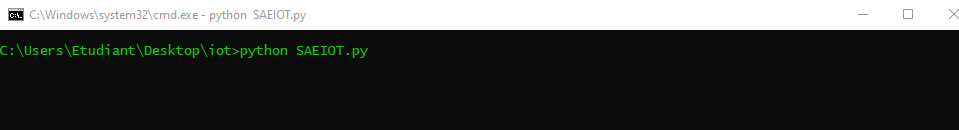

= Nom de l'application
:authors: Groupe G1A-1 
:toc:
:toclevels: 4
:sectnums:
:sectanchors:
:icons: font

== Introduction

Notre application Python vous permet de récupérer les données envoyées par les capteurs des différents entrepôts de stockage des produits et de les stocker dans des fichiers. 

L'objectif ensuite sera d'utiliser une deuxième application pour modifier la configuration de la première et lire les données stockées.

== Description

Ce programme utilise la bibliothèque paho.mqtt pour se connecter à un serveur MQTT et recevoir des messages. Il utilise également les bibliothèques os, signal, time, json, xmltodict, datetime et threading pour effectuer des opérations système, gérer les temps d'attente, travailler avec des données JSON, convertir des fichiers XML en dictionnaires Python, gérer les dates et les heures et gérer les threads, respectivement.

== Structure

La structure générale du code est la suivante:

- Importation des bibliothèques nécessaires :
```python
import paho.mqtt.client as mqtt
import os
import signal
import time
import json
import xmltodict
import datetime
import threading
```

- Lecture des informations de configuration à partir d'un fichier XML :
```python
with open("config.xml") as fd:
    config = xmltodict.parse(fd.read())
    
config = config["config"]
```

- Création d'un dictionnaire vide pour stocker les données reçues :
```python
dataTable = {}

for v in toDraw:
    dataTable[v] = 0
```

- Création d'un client MQTT et définition de la fonction de traitement des messages reçus :
```python
client = mqtt.Client("SAE_G1A-1")

def on_message(client, userdata, message):
    
    print("message")
    
    out = os.open(str(config["outFolder"]) + "/" + "LastMessageTime.dce", os.O_CREAT | os.O_TRUNC | os.O_WRONLY)
    os.write(out, bytes(str(datetime.datetime.now()), 'utf-8'))
    os.close(out)
    
    data = json.loads(message.payload.decode("utf-8"))
    data = data["object"]

    for v in toDraw:
        dataTable[v] = data[v]
```

- Définition de la fonction pour enregistrer les données :
```python
def saveData() :
    print("saving data")
    for test in toDraw:
        if toDraw[test] == "True":
            out = os.open(str(config["outFolder"]) + "/" + str(test)+".dce", os.O_CREAT | os.O_TRUNC | os.O_WRONLY)
            os.write(out, bytes(str(dataTable[test]), 'utf-8'))
            os.close(out)

            if dataTable[test] >= int(max[test]) or dataTable[test] <= int(min[test]):
                out = os.open(str(config["outFolder"]) + "/alerte" + str(test) + ".dce", os.O_CREAT | os.O_TRUNC | os.O_WRONLY)
                os.write(out, bytes(str(dataTable[test]) + ":" + str(datetime.datetime.now()), 'utf-8'))
                os.close(out)
```

- Définition de la fonction pour enregistrer les données périodiquement :
```python
def set_interval(fonction, temps):
    def func_wrapper():
        set_interval(fonction, temps)
        fonction()
    t = threading.Timer(temps, func_wrapper)
    t.start()
    return t
```

- Connexion au serveur MQTT, abonnement au sujet d'événement et démarrage de la boucle d'écoute pour les messages :
```python
set_interval(saveData, int(config["frec"]))

client.connect(config["server"])
client.subscribe("application/" + config["app"] + "/device/" + config["device"] + "/event/up")
client.on_message=on_message
client.loop_start()
```

- Attente avant de quitter :
```python
time.sleep(timeSleep)

client.loop_stop()
```


== Prérequis

L'application nécessite plusieurs choses qu'il vous faudra installer au préalable :

- `Python 3` ou une version ultérieure.
- le module python `xmltodict`
- le module python `paho-mqtt`

Ces deux modules étant disponible avec la commande `pip install <module>`



== Installation

Pour installer l'application, suivez ces étapes :

1. Téléchargez l'application Python à partir de cette URL : https://downgit.github.io/#/home?url=https://github.com/IUT-Blagnac/sae3-01-devapp-g1a-1/blob/master/Applications/Python/SAEIOT.py[application.py]

2. Téléchargez le fichier de configuration à partir de cette URL : https://yehonal.github.io/DownGit/#/home?url=https:%2F%2Fgithub.com%2FIUT-Blagnac%2Fsae3-01-devapp-g1a-1%2Fblob%2Fmaster%2FApplications%2FPython%2Fconfig.xml[configuration.xml]

3. Regroupez l'application et le fichier de configuration dans un dossier de votre choix.



== Utilisation

Pour exécuter votre application, il ne vous reste plus qu'a ouvrir un terminal, vous placer dans le dossier où se trouve l'application et exécuter la commande suivante : 

`python SAEIOT.py`



Et voila, votre application est lancé et sauvegardera toutes les 15 min les dernières données récupérées sur les capteurs.

== Ressources supplémentaires

L'application Java permettra ensuite de modifier le fichier de configuration et de lire les données écrites.

cf. https://github.com/IUT-Blagnac/sae3-01-devapp-g1a-1/blob/master/Documentation/Technique/DocTechnique.adoc[Documentation technique de l'application Java]


