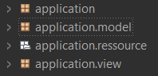
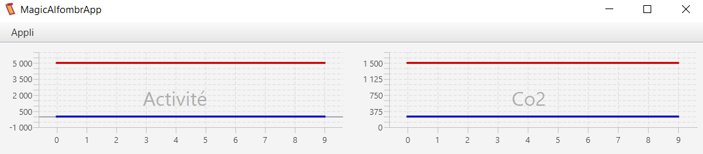
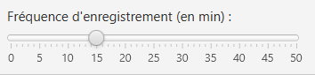
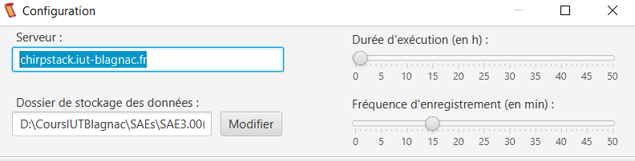
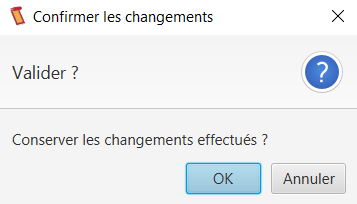
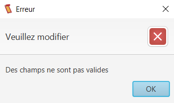
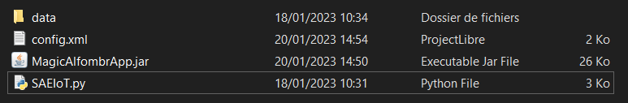

= Documentation technique solution JAVA
:toc:
:toc-title: Table des matières
:sectnums:
:sectnumlevels: 4

== Introduction
Ce document a pour but de renseigner un utilisateur sur comment fonctionne l'application, comment l'intaller, comment installer un environement de travail pour la modifier ou encore comment l'utiliser.

== Architecture de la solution

=== Architecture générale
Notre application est, sans rentrer dans les détails pour l'instant, organisée en packages. Elle a une architecture communément utilisé ce qui permet de se retrouver assez facilement dans le code.

=== Ressources externes
Nous avons pour ce projet eu recours à quelques ressources externes telle que le Java XML parser. Celle-ci nous a permis de lire et écrire un fichier .xml que nous avons donc utilisé comme fichier de configuration pour nos application.

=== Structuration en packages

Comme cité précédemment, notre application est organisée en packages. Ceux-ci suivent plus ou moins une structure Model View Controller (MVC). En effet, nous avons un package "application" contenant notamment la classe Main, puis un package "application.model" contenant les classes d'accès au fichier de configuration et aux fichiers de données et enfin un package "application.view" contenant les fichiers FXML des pages de l'application et les classes Controller. En plus de ceux-là, un package "application.ressource" contient les images et les fichiers .css de l'application.

== Explication des fonctionnalités 
Dans cette partie nous allons voir les deux fonctionnalités de l'application et les détailler.

=== Affichage des données
Notre application a pour but principal d'afficher les données récupérées des capteurs dans des graphes, c'est donc sa fonctionnalité phare. 

L'application récupère donc les données et affiche sur la page d'accueil un graphe par donnée avec un minimum et un maximum défini par l'utilisateur.

==== Classes impliquées
Pour cette fonctionnalité, 5 classes principalessont impliquées. Tout d'abord les classes Main et MainMenuController qui permettent d'afficher la page d'accueil. Ensuite la classe Updater contient le code qui s'éxécute dans un thread permettant de mettre à jour les données en temps réel. Elle appel donc la classe DataReader qui lit les fichiers de données et met à jour les DataArray (de la classe du même nom) qui stockent les données. Enfin la classe MainMenuController affiche ces données sur les graphes de la page. 

==== Eléments essentiels
Il est important de savoir que le thread Updater est appelé tout les x temps, x correspondant à la fréquence de mise à jour définie par l'utilisateur dans le fichier de configuration.

=== Modification du fichier de configuration
Pour fonctionner, l'application s'appuie sur un fichier de configurateur lui dictant son comportement. Celui-ci doit être modifiable par l'utilisateur. C'est pourquoi notre application en est capable. 

En effet depuis la page d'accueil une page de configuration est accessible. Sur celle-ci, l'on peut modifié la configuration, enregistrer les modification ou les annuler.

==== Classes impliquées
Pour le fonctionnement de cette page, 3 classes travaillent ensemble, ConfigFileAccess, Config et ConfigController. ConfigController affiche la page et gère les élèments interactifs de la page tandis que ConfigFileAcces lit et écrit le fichier de configuration pour créer une Config (de la classe du même nom) et stocker la configuration actuelle de l'appication.

==== Eléments essentiels
Noter qu'une pop-up apparait pour confirmer l'enregistrement des modifications et que l'état cohérent de la configuration est garanti par différentes vérifications.

 

== Procédures d'installation 
Nous verrons ici comment installer l'application, que ce soit pour installer un environement de développement pour maintenir l'application ou pour une utilisation simple.

=== Pour le développement : comment installer l'environnement de développement
Pour mettre en place un environement de travail fonctionnel, il faut : 

- Un IDE java (Eclipse par exemple)
- Un JRE/JDK antérieur à Java 1.8 où le SDK javaFX
- SceneBuilder ou autre éditeur FXML.

NOTE : Les fichiers contenant le code source utilisent l'encodage utf-8

=== Pour le poste utilisateur final avec l'application Python : comment installer et lancer l'application
Pour installer l'appication, il suffit de :

- Télécharger le fichier .jar (https://github.com/IUT-Blagnac/sae3-01-devapp-g1a-1/blob/master/Applications/Java/MagicAlfombrApp.jar[MagicAlfombrApp.jar])
- Placer le jar dans le même dossier que l'application python (cf. https://github.com/IUT-Blagnac/sae3-01-devapp-g1a-1/blob/master/Applications/Python/DocUtilPython.adoc[Documentation Python])

- Double-cliquer sur le jar

Et voilà ! votre application est lancée !

