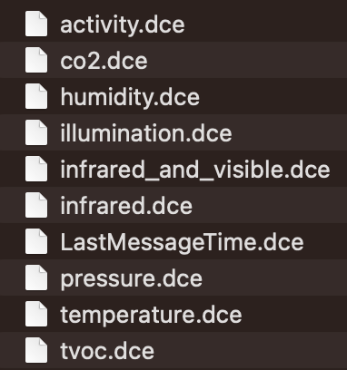
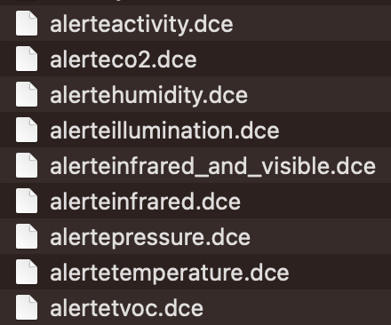
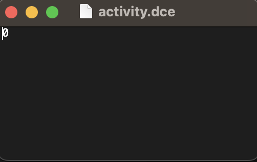
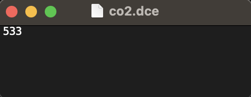
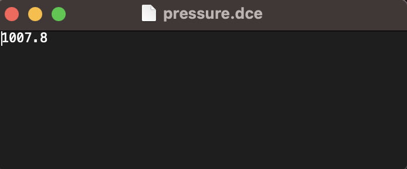
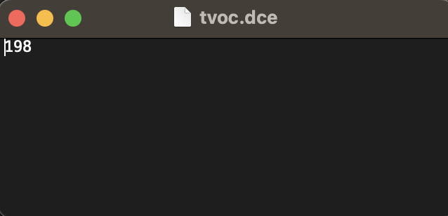
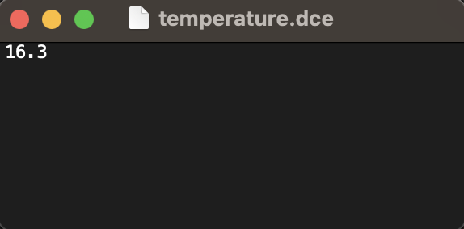
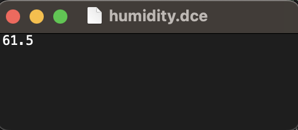

= Tests de la solution IoT (Python)

:toc:
:toc-title: Table des matières
:sectnums:
:sectnumlevels: 2

== Introduction

Cette documentation décrit les tests effectués sur la solution IoT côté Python. Elle contiendra une partie montrant le code testé, une partie expliquant le code testé et une partie démontrant que le code testé fonctionne.

== Exécution des tests

=== Code testé 

Le code testé est le suivant :

```python
import paho.mqtt.client as mqtt
import os
import signal
import time
import json
import xmltodict
import datetime
import threading

with open("config.xml") as fd:
    config = xmltodict.parse(fd.read())
    
config = config["config"]

toDraw = config["toDraw"]
max = config["max"]
min = config["min"]
timeSleep = int(config["timeSleep"])

dataTable = {}

for v in toDraw:
    dataTable[v] = 0

client = mqtt.Client("SAE_G1A-1")

def on_message(client, userdata, message):
    
    print("message")
    
    out = os.open(str(config["outFolder"]) + "/" + "LastMessageTime.dce", os.O_CREAT | os.O_TRUNC | os.O_WRONLY)
    os.write(out, bytes(str(datetime.datetime.now()), 'utf-8'))
    os.close(out)
    
    data = json.loads(message.payload.decode("utf-8"))
    data = data["object"]

    for v in toDraw:
        dataTable[v] = data[v]

    # print("message topic=",message.topic)
    # print("message qos=",message.qos)
    # print("message retain flag=",message.retain)


def saveData() :
    print("saving data")
    for test in toDraw:
        if toDraw[test] == "True":
            out = os.open(str(config["outFolder"]) + "/" + str(test)+".dce", os.O_CREAT | os.O_TRUNC | os.O_WRONLY)
            os.write(out, bytes(str(dataTable[test]), 'utf-8'))
            os.close(out)

            if dataTable[test] >= int(max[test]) or dataTable[test] <= int(min[test]):
                out = os.open(str(config["outFolder"]) + "/alerte" + str(test) + ".dce", os.O_CREAT | os.O_TRUNC | os.O_WRONLY)
                os.write(out, bytes(str(dataTable[test]) + ":" + str(datetime.datetime.now()), 'utf-8'))
                os.close(out)

def set_interval(fonction, temps):
    def func_wrapper():
        set_interval(fonction, temps)
        fonction()
    t = threading.Timer(temps, func_wrapper)
    t.start()
    return t

set_interval(saveData, int(config["frec"]))

client.connect(config["server"])
client.subscribe("application/" + config["app"] + "/device/" + config["device"] + "/event/up")
client.on_message=on_message
client.loop_start()

time.sleep(timeSleep)

client.loop_stop()
```
=== Explication

Le code précedent doit pouvoir récuperer les données intéressantes des capteurs et les sauvegarder dans des fichiers .dce du nom de la valeur récupérée. Il doit aussi pouvoir sauvegarder les alertes (si les valeurs sont en dessous d'une certaine valeur minimale ou au dessus d'une certaine valeur maximale configurées dans un fichier de config) dans des fichiers .dce du nom "alerte" + nom de la valeur récupérée.

=== Démonstration

Pour démontrer que le code fonctionne, nous avons effectué les tests suivants :

* Vérifier que les fichiers .dce sont bien créés       
* Vérifier que les alertes sont bien créées
* Vérifier que les fichiers .dce contiennent bien les données récupérées

Suite au lancement du code, nous pouvons constater que les fichiers .dce sont bien créés et que les alertes sont bien créées. (Images ci-dessous)

`Données récupérées` : 



Alertes créées :



Nous pouvons aussi constater que les fichiers .dce contiennent bien les données récupérées :

* *Activité* :



* *CO2* :



* *Pression* :



* *TVOC* :



* *Température* :



* *Humidité* :

   

Si une donnée n'est pas claire pour vous, veuillez vous référer à la documentation des différentes données récupérées via ce lien ci-dessous :

https://github.com/IUT-Blagnac/sae3-01-devapp-g1a-1/blob/master/Applications/Python/Documentation_IoT_G1A-1.pdf[Documentation IoT G1A-1]

== Conclusion

Suite à ces tests, nous avons pu constater que le code fonctionne bien et que toutes les étapes sont passées avec succès.


