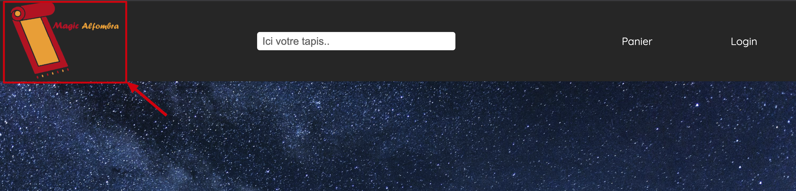
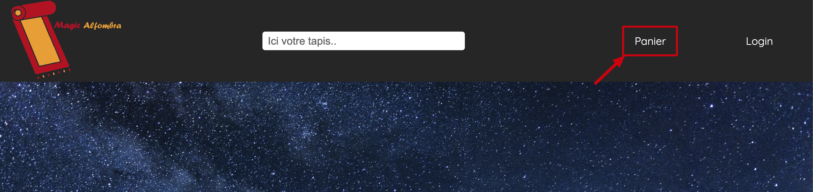

= Documentation Utilisateur site web G1A-1
:toc:
:toc-title: Table des matières
:sectnums:
:sectnumlevels: 4
:hide-uri-scheme:   

== Introduction
Bienvenue sur notre site web ! Ce guide d'utilisation a été conçu pour vous aider à naviguer sur notre site et à en tirer le meilleur parti. Il vous expliquera comment accéder aux différentes sections et fonctionnalités, ainsi que les étapes à suivre pour effectuer des tâches courantes, telles que la création d'un compte ou la consultation d'un produit. Si vous rencontrez des problèmes ou des questions, n'hésitez pas à consulter notre section d'aide ou à nous contacter directement. Merci d'utiliser notre site !

== Accéder au site web

=== Avec le réseau de l'IUT (filaire)
Afin d'accéder à notre site ouvrez votre navigateur web et saisissez l'adresse suivante : http://192.168.224.139/~SAESYS01/

=== Avec votre propre réseau

Afin d'accéder à notre site ouvrez votre navigateur web et saisissez l'adresse suivante : http://193.54.227.164/~SAESYS01/

== Accueil

=== En-tête du site 

Lorsque vous êtes redirigé vers notre site vous arrivez sur la page d'accueil. Vous pouvez y accéder à tout moment en cliquant sur le logo de notre site en haut à gauche de la page.

=== Pied de page du site

Le pied de page du site contient des informations sur notre société, ainsi que des liens vers nos réseaux sociaux. (Servant notamment à nous contacter)

== Recherche de produit 

Pour rechercher un produit, il vous suffit de cliquer sur la barre de recherche au milieu de la page et de saisir le nom du produit que vous souhaitez trouver. (`À VENIR PROCHAINEMENT...`)

== Consultation du panier

Afin de consulter le panier, il vous suffit de cliquer sur le bouton `Panier` en haut à droite de la page.

=== Si vous n'êtes pas connecté

Si vous n'êtes pas connecté, vous serez redirigé vers la page de connexion. Il vous suffira de soit vous connecter, soit créer un compte.

=== Si vous êtes connecté

Si vous êtes connecté, vous arriverez sur la page de consultation de votre panier. Vous pouvez alors soit consulter les produits que vous avez ajouté, soit les supprimer. 

== Création de compte

Pour créer un compte, il vous suffit de cliquer sur le bouton `Login` en haut à droite de la page.

Vous serez alors redirigé vers la page de connexion. Il vous suffit de cliquer sur le bouton `Cliquez ici` pour accéder au formulaire de création de compte.

Vous arriverez alors sur la page de création de compte. Il vous suffit de remplir les champs avec vos informations personnelles.

image::images/creationCompte.jpg[creationCompte]

Et de cliquer sur le bouton "valider".

Un compte sera alors crée avec succès. Vous pouvez maintenant vous connecter avec vos identifiants. 

== Connexion à un compte

=== Suite à la création d'un compte

Si vous venez de créer un compte, vous serez automatiquement redirigé vers la page de connexion (avec votre nom d'utilisateur prérempli). Il vous suffit de saisir votre mot de passe et de cliquer sur le bouton "Se connecter".

=== Via le bouton "Se connecter"

Pour vous connecter à votre compte, il vous suffit de cliquer sur le bouton `Login`` en haut à droite de la page.

Vous serez alors redirigé vers la page de connexion. Il vous suffit de saisir votre nom d'utilisateur et votre mot de passe 

Et de cliquer sur le bouton `Valider`.

Vous avez également une option "Se souvenir de moi" qui vous permettra de rester connecté sur notre site. Vous avez simplement à cocher la case correspondante. 

== Consultation des produits

Pour consulter les produits, il vous suffit de cliquer sur le bouton `Découvrir nos produits` en haut à gauche de la page. 

Cela vous redirigera sur une nouvelle page dans laquelle vous pourrez observer les divers produits disponibles.

== Consultation des détails d'un produit [[anchor:detailsProduit]]

Pour consulter les détails d'un produit, il vous suffit de cliquer sur l'un des produits disponibles sur la page des produits.

Cela vous redirigera sur une nouvelle page dans laquelle vous pourrez observer les détails du produit sélectionné.

== Ajout d'un avis

Dans la page de <<anchor:detailsProduit>>, il vous suffit de cliquer sur le nombre d'étoiles que vous souhaitez donner au produit, de donner une description à cette avis (Facultatif) et de cliquer sur le bouton `Envoyez l'avis` pour confirmer l'ajout de l'avis.

Cela affichera votre avis dans la liste des avis du produit sélectionné.

